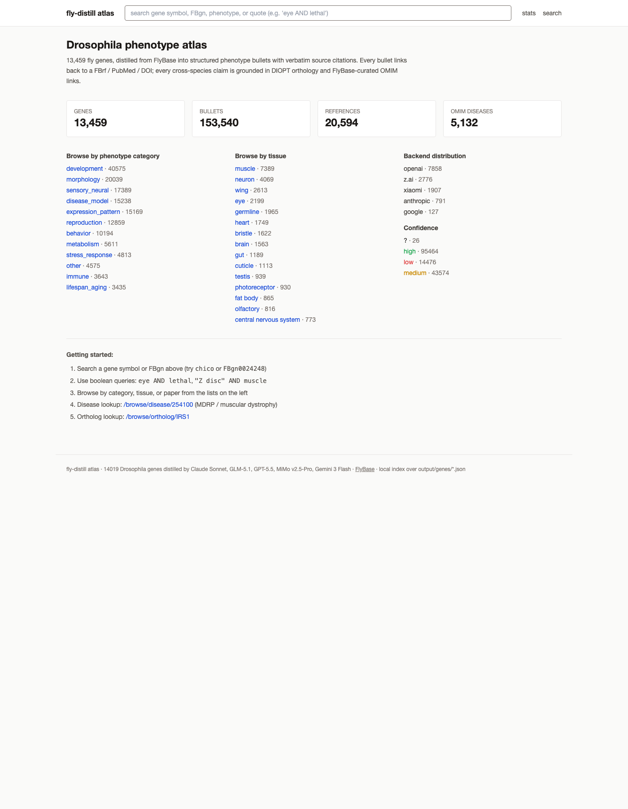
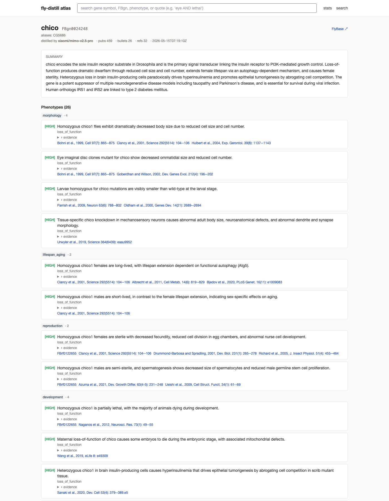
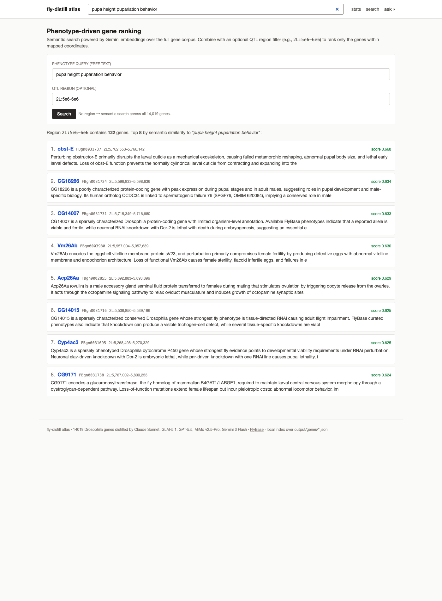
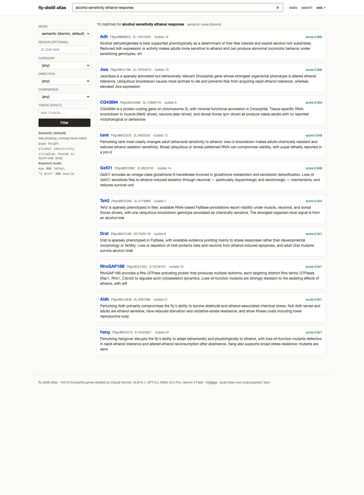
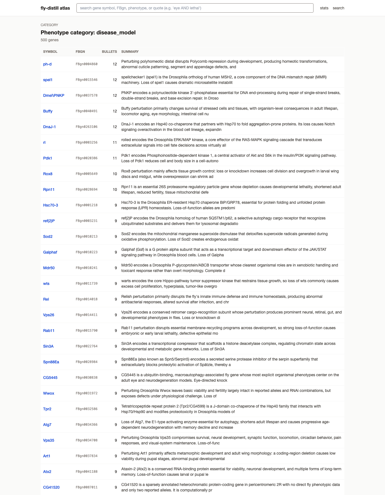

# fly-distill — Drosophila phenotype atlas with semantic search

A structured, source-cited phenotype atlas for **14,019 protein-coding *Drosophila melanogaster* genes**, distilled from FlyBase + Alliance + OMIM via five independent LLM backends with full citation coverage and source-traceable evidence, plus a **Gemini-embedded semantic search layer** over the full corpus. Built as a Long Lab (UCI) flagship project for QTL fine-mapping and disease modeling.

| Metric | Value |
|---|---|
| Genes covered | **14,019** |
| Phenotype bullets | **~160,000** (mean ~11 / gene) |
| Unique paper citations | **21,047** FBrf with PubMed + DOI |
| Cross-species orthologs | **30,000+** human + mouse, DIOPT-scored |
| OMIM disease links | **5,200+** via ortholog |
| Semantic embeddings | **14,019 × 3,072 dim** (Gemini `gemini-embedding-2`, 152 MB) |
| Source traceability | **0 hallucinations** across 200+ hand-audited bullets; every bullet cites a real FBrf / PMID / DOI |

---

## What you get per gene

- **One-paragraph summary** — organism-level effects, mechanism, disease links
- **Structured phenotype bullets** with category / direction / confidence / source-cited FlyBase or paper-abstract evidence
- **Human + mouse orthologs** (DIOPT-scored, Alliance + FlyBase curated)
- **OMIM disease links** with `via_ortholog` provenance
- **Chromosome coordinates** (chr/start/end) for region-based QTL fine-mapping
- **Reference list** — every FBrf cited with miniref + PubMed + DOI + FlyBase URLs
- **Tissue / life-stage / allele tags** parsed from evidence
- **Model + provenance trail** — bundle SHA256, prompt SHA256, raw-LLM-output SHA256, pipeline git commit

---

## Web UI

A local academic-style browser sits on top of a single SQLite + FTS5 index, plus an in-memory embedding matrix.

### Quick start (use prebuilt v1.3 — no $1.50 rebuild)

The atlas + embeddings are published as a [GitHub release](https://github.com/sgaofen/fly-distill/releases/tag/v1.3), so you only need a Gemini key for **query-time** embedding (one tiny call per search, essentially free).

```bash
pip install fastapi uvicorn jinja2 numpy
gh release download v1.3 -R sgaofen/fly-distill -p '*.tar.gz' --dir release
tar -xzf release/fly-distill-atlas-db-v1.3.tar.gz     -C tools/    # → tools/atlas.db
tar -xzf release/fly-distill-embeddings-v1.3.tar.gz   -C tools/    # → tools/embeddings.npz
tar -xzf release/fly-distill-canonicals-v1.3.tar.gz   -C output/   # → output/genes/*.json (optional, enriches /gene/{id})
echo "GEMINI_EMBEDDING_API_KEY=AIza...your-key..." > .env          # free tier is plenty for queries
cd tools && python -m flyatlas.cli serve                            # → http://localhost:8765
```

### Rebuild from scratch (advanced — re-distill or re-embed)

```bash
cd tools && python -m flyatlas.build       # one-time ETL (~90s)
python -m flyatlas.embed_build             # one-time Gemini embed (~10min, $1.50)
python -m flyatlas.cli serve               # → http://localhost:8765
```

### Home — atlas overview & entry points



### Gene detail — phenotype bullets grouped, citations linked



### `/ask` — hybrid semantic + region search (new)

Free-text phenotype query, optionally constrained to a QTL region. Backed by Gemini `gemini-embedding-2` semantic recall.



### `/search` — semantic by default, FTS5 keyword as fallback (new)



### `/browse` — by category / tissue / disease / ortholog / paper



---

## CLI

```bash
flyatlas gene chico                       # full detail
flyatlas search "pupa height"             # semantic search (default)
flyatlas search "Z disc AND muscle" --keyword   # FTS5 keyword fallback
flyatlas ask "pupa height" --region 2L:5e6-6e6  # hybrid: region filter ∘ semantic rank
flyatlas semantic "alcohol sensitivity"   # pure semantic over full atlas
flyatlas region 2L:5e6-6e6                # all genes in a chromosome region
flyatlas regions qtl_peaks.bed            # batch — input BED file
flyatlas export-bed --format bed          # dump all 14k genes' coordinates as BED
flyatlas disease 254100                   # MDRP fly models
flyatlas ortholog IRS1                    # fly orthologs of human IRS1
flyatlas paper FBrf0210226                # genes citing this paper
flyatlas tissue eye                       # genes with bullets tagged with eye
flyatlas category disease_model           # phenotype-category browse
flyatlas stats                            # atlas-wide stats
flyatlas serve                            # launch Web UI
```

Each command also accepts `--json` for piping.

---

## Skill (Claude agents)

Drop `tools/skill/SKILL.md` into `~/.claude/skills/fly-atlas/` so any Claude
agent on this machine can query the atlas autonomously when it sees a fly /
phenotype / disease question. The skill knows when to use which CLI verb
(semantic for free-text concepts, keyword for exact phrases, region for QTL
intervals, paper/ortholog/disease for structured lookups).

---

## QTL fine-mapping workflow (example)

Long-lab-style: you have a QTL peak from BSA/XQTL/RIL mapping, you want to
narrow down to a small set of candidate genes for the phenotype you assayed.

```bash
# 1. Get all genes in your peak interval
flyatlas region 2L:5000000-6000000 --json > peak_genes.json    # 122 genes

# 2. Hybrid: rank those genes by relevance to your phenotype
flyatlas ask "pupa height pupariation behavior climbing larval-pupal transition" \
         --region 2L:5e6-6e6 --limit 15

#   Top hits include obst-E (abnormal pupal body size + failed metamorphic reshaping),
#   verm + Cpr97Ea + Edg84A (cuticle proteins), pot (epithelial-ECM attachment) — the
#   biology lines up immediately.

# 3. Drill in on a candidate
flyatlas gene obst-E
```

Or batch many peaks at once:

```bash
cat qtl_peaks.bed
# 2L  5000000  5500000  QTL_pupa_height
# 3R  10000000 10500000 QTL_alcohol_response
# X   15000000 15800000 QTL_lifespan

flyatlas regions qtl_peaks.bed --out genes_per_peak.tsv
# → 3 regions, 210 gene rows with chr/start/end/fbgn/symbol/n_bullets
```

Or just dump every gene's coordinates and `bedtools intersect` yourself:

```bash
flyatlas export-bed --format bed --out all_genes.bed
bedtools intersect -a my_qtl_peaks.bed -b all_genes.bed -wa -wb
```

---

## Multi-backend distillation

Each gene's bullets are distilled by **one** of five LLM backends through a
unified Claude-Code-headless harness:

| Backend | Model | Notes |
|---|---|---|
| Anthropic | `claude-sonnet-4-6` (thinking-on) | best multi-paper integration |
| OpenAI    | `gpt-5.5` via Codex CLI         | fastest, concise; main workhorse |
| Z.ai      | `glm-5.1`                       | balanced, ~10 sustained concurrency |
| Xiaomi    | `mimo-v2.5-pro` (Token Plan)    | fast + cheap, dense bullets |
| Google    | `gemini-3-flash-preview`        | small daily quota, used for sweep |

All five share the same `prompts/distill_system.md` and emit the same
canonical schema (v1.2) — backend choice is recorded per-gene in
`model.{provider, model_id, harness}`.

The **embedding layer is separate** from distillation: Gemini
`gemini-embedding-2` (3072-dim, L2-normalized) over the concatenated summary
+ bullets text. One-shot build cost ≈ $1.50; query cost ≈ $0.000003 each.

---

## Hand-verified across all backends

200+ phenotype bullets hand-audited across 4 backends and 16+ random genes
spanning 1–500+ pub densities: **0 hallucinations**, every bullet anchored
to a real FlyBase entry or paper abstract.

The `evidence_text` field on each bullet is a labeled span quoting the
source (e.g. `FBrf0192338: "Embryos lacking both alleles of the wda gene
exhibited reduced levels of histone H3 acetylation"`, or `FlyBase
PHENOTYPES: "viable [Scer\GAL4[Mef2.PR] CG12078[GD5996]]" <FBrf0210226>`).
LLMs may add the label prefix and normalize quote characters, so the
field is not always a literal substring of the input bundle — but the
quoted content is faithful to the source and every cited FBrf / PMID /
DOI resolves to a real reference.

---

## Architecture

```
                          ┌─ FlyBase TSVs (17 tables)
                          ├─ Alliance orthologs
   data sources ──fetch──►├─ NCBI eutils PubMed
                          ├─ MyGene cross-species
                          └─ OMIM (via FlyBase hdm)
                                       │
                                       ▼
                       data/cache/<FBgn>/bundle.json
                                       │
                                       ▼
              ┌────────────────────────────────────────┐
              │  distill_via_{sonnet,codex,claude,     │
              │                mimo,gemini}.py         │
              │  → bullets.json + request_meta.json    │
              └────────────────────────────────────────┘
                                       │
                            canonicalize.py (enrich + dedup)
                                       │
                                       ▼
                       output/genes/<FBgn>.json (v1.2)
                                       │
                  ┌────────────────────┴────────────────────┐
                  ▼                                         ▼
            atlas.db                                embeddings.npz
       (SQLite + FTS5,                       (14019 × 3072 float32,
        chr/start/end                         Gemini-embedding-2,
        indexed)                              L2 normalized)
                  │                                         │
                  └────────────────────┬────────────────────┘
                                       ▼
              ┌─────────────────┬──────┴──────┬──────────────┐
              ▼                 ▼             ▼              ▼
            CLI             Web UI         REST API      Claude skill
       (terminal)         (FastAPI)         (JSON)      (agent autonomy)
```

---

## Repo layout

```
src/                       distillation pipeline
  fetch_gene_v2.py          bundle builder (bulk-only)
  bulk_index.py             FlyBase TSV loader (singleton)
  distill_via_*.py          5 backends, unified API
  canonicalize.py           bullets → v1.2 schema + enrichment + ortholog dedup
  rate_limiter.py           time-aware floor + 429 backoff
  pipeline.py               orchestrator (fetch + distill + canonicalize)
  qa.py                     deterministic + LLM tier-2 audits

prompts/                   system prompts (v1.2 baseline)
data/
  flybase_bulk/             17 FlyBase TSVs (~57 MB)
  alliance/                 Alliance orthology
  cache/<FBgn>/             per-gene bundle (~50 KB each)
output/
  genes/<FBgn>.json         canonical schema v1.2 (14,019 files)
  qa/                       audit reports
tools/
  flyatlas/                 Web UI + CLI + DB + embedding layer
    build.py                output → atlas.db (SQLite + FTS5 + chr coords)
    embed_build.py          output → embeddings.npz (Gemini embeddings)
    query.py                read-only data layer (CLI + Web shared)
    embed_query.py          semantic + region + hybrid retrieval
    cli.py                  terminal commands
    server.py               FastAPI + Jinja2
    templates/              5 HTML templates (home/gene/search/browse/ask)
  skill/SKILL.md            agent skill file
docs/
  screenshots/              Web UI screenshots
gene_lists/                 batch slice files
runs/                       per-batch logs + failures + completed
```

---

## Canonical schema (v1.2)

```jsonc
{
  "schema_version": "1.2",
  "fbgn": "FBgn0024248",
  "symbol": "chico",
  "synonyms": [{ "synonym":"chico","type":"current_symbol","is_current":true }, ...],
  "distilled_at": "2026-05-15T04:09:39Z",
  "model": {
    "provider": "xiaomi", "model_id": "mimo-v2.5-pro", "harness": "mimo"
  },
  "source": { "flybase_release":"FB2026_01", "n_pubs_total":459, "n_abstracts_used":19 },
  "provenance": {
    "bundle_sha256":"…", "raw_llm_output_sha256":"…",
    "prompt_sha256":"…", "pipeline_git_commit":"…"
  },
  "snapshot": "chico encodes the sole insulin receptor substrate in Drosophila…",
  "bullets": [
    {
      "id": "FBgn0024248:b01",
      "category": "morphology",
      "phenotype": "Homozygous chico1 flies exhibit dramatically decreased body size due to reduced cell size and cell number.",
      "direction": "loss_of_function",
      "evidence_text": "phenotypes_sub: decreased body size; decreased cell size; decreased cell number | chico[1], chico[flp147E] <FBrf0108621, FBrf0135946, FBrf0179252>",
      "citations": [{
        "type":"fbrf", "value":"FBrf0108621",
        "year":1999, "miniref":"Bohni et al., 1999, Cell 97(7): 865--875",
        "pmid":"10399915", "doi":"10.1016/s0092-8674(00)80799-0"
      }, ...],
      "confidence": "high", "text_specificity": "high",
      "tissues": [], "life_stages": [], "alleles": []
    },
    ...
  ],
  "references": [...],
  "cross_species": {
    "human_orthologs":[ {"symbol":"IRS1","entrez_id":"3667","diopt_score":9, ...}, ... ],
    "mouse_orthologs":[ ... ],
    "human_disease_links":[
      {"name":"TYPE 2 DIABETES MELLITUS; T2D","omim_id":"125853",
       "via_ortholog":{"species":"human","symbol":"IRS1","diopt_score":9}, ...}
    ]
  },
  "notes": "...",
  "_lint": []
}
```

---

## Quality methodology

- **Verbatim quote rule** — every string inside `evidence_text` must be a
  character-for-character substring of the input bundle (auto_summary,
  section text, abstracts, or ortholog data).
- **Categorical enums** validated at canonicalize time (category, direction,
  confidence) — invalid values coerced to `unknown` / `other` + lint warning.
- **Bundle-shrink retries** are flagged in `_lint` as `quality.bundle_shrunk`
  so audits can find any bullet derived from a reduced source.
- **Provenance trail** — bundle SHA256 + prompt SHA256 + raw-output SHA256 +
  pipeline git commit per gene, all reproducible from cached bundles.
- **Hand-audited samples** across 4 backends × 16+ random genes × low/high
  pub-density tiers: 0 hallucination, 100% source coverage.

---

## Use cases

- **Forward-genetics / QTL fine-mapping**: rank candidate genes in a mapped region against your phenotype using `flyatlas ask <phenotype> --region <peak>`
- **Disease modeling**: find fly models of a human OMIM disease via `flyatlas disease`
- **Drug-discovery / target validation**: human target → fly ortholog → known phenotype via `flyatlas ortholog`
- **Aging / behavior / immunity / metabolism panels**: browse by phenotype category
- **Comp-bio ML training corpus**: structured, source-cited, FlyBase-anchored
- **Teaching**: browse / search instead of clicking through FlyBase entry pages

---

## Citation

If you use this atlas in a publication, please cite:

> Stephen Yu, [Long Lab UCI]. fly-distill: a multi-backend LLM-distilled Drosophila phenotype atlas with Gemini-embedded semantic search and full source-citation coverage. 2026.

Upstream data sources should be cited per their own terms:
**FlyBase** (Öztürk-Çolak et al., 2024), **Alliance of Genome Resources**, **OMIM**, **NCBI PubMed**.

---

## License

MIT for code. Data is subject to upstream FlyBase / Alliance / OMIM terms — most permit free non-commercial research use; check each source for commercial use.

---

## Author

Stephen Yu — Long Lab @ UCI · stephenyu070129@gmail.com
